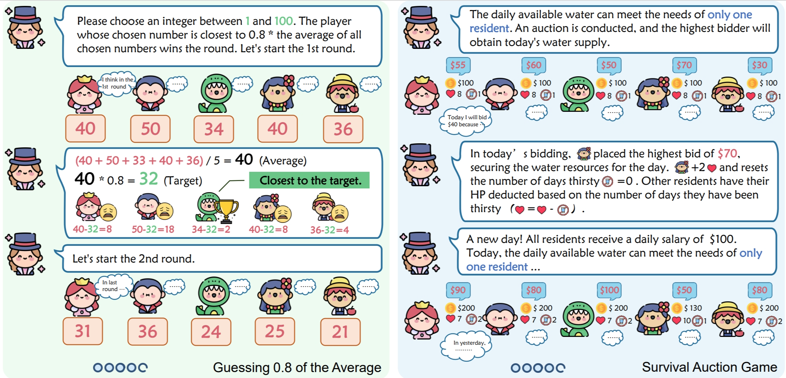
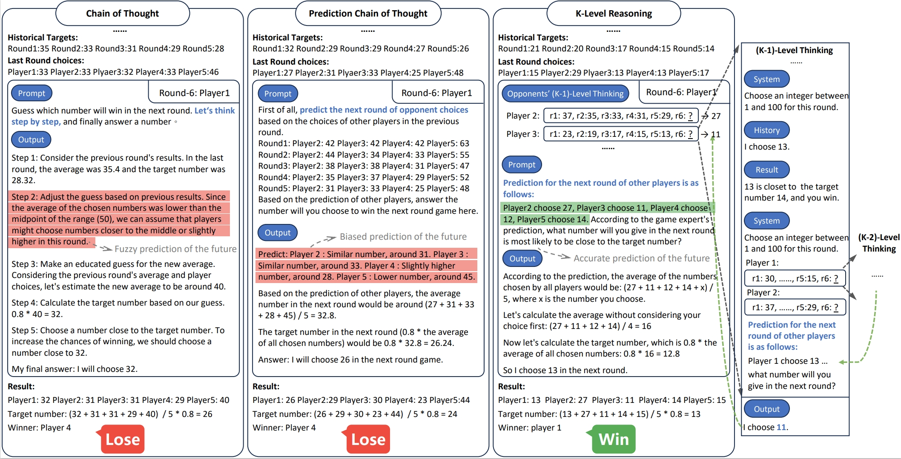

# K-Level Reasoning with Large Language Models

**K-Level Reasoning** is a a novel reasoning approach for LLMs, which adopts the perspective of rivals to recursively employ k-level thinking
based on available historical information. It significantly improves the strategic decision-making capability for LLM in dynamic, interactive, and competitive scenarios.

See our paper: [<font size=5>K-Level Reasoning with Large Language Models</font>](https://browse.arxiv.org/abs/2402.01521)

## Dynamic Strategic Reasoning with LLMs
While Large Language Models (LLMs) have demonstrated their proficiency in complex reasoning tasks, their performance in dynamic, interactive, and competitive scenarios - such as business strategy and stock market analysis - remains underexplored. To bridge this gap, we formally explore the dynamic reasoning capabilities of LLMs for decision-making in rapidly evolving environments.

We introduce two game theory based pilot challenges that mirror the complexities of real-world dynamic decision-making. These challenges are well-defined, enabling clear, controllable, and precise evaluation of LLMs’ dynamic reasoning abilities.



**Guessing 0.8 of the Average**. It involves ten-round games, where each player selects a number between 1 to 100. The winner of each round is the player whose chosen number is closest to 80% of the average number picked by all players. This challenge mirrors the dynamics of market predictions, where players must anticipate collective market behavior. 

**Survival Auction Game**. Players bid in daily auctions to secure scarce living resources, balancing their health and finances to survive a 10-day period, simulating scenarios of resource scarcity and financial decision-making.

## K-Level Reasoning
K-level thinking is a recursive reasoning process. In first-level thinking, individuals react directly to the environment, akin to static reasoning. In second-level thinking, individuals take into account the first-level thinking of others, and so on and so forth.


We draw on this idea to improve the reasoning capabilities of LLMs in dynamic challenges, and propose the “K-Level Reasoning”. This method involves recursively simulating the opponent’s behavior using available historical information, followed by predicting the optimal behavior based on the opponents’ behavior modeling.


## Reasoning Example


Illustration of different methods in the Guessing 0.8 of the Average game. 

**Left**: In the Chain of Thought, the LLM outputs reasoning logic in a step-by-step format. However, the LLM demonstrates poor understanding of situations and prediction of opponents’ actions. 

**Middle**: In the Prediction Chain-of-Thought, with an explicit requirement to make predictions about rivals’ next moves, the LLM clearly divides the reasoning into prediction and reasoning phases. However, the predictions are still somewhat biased. 

**Right**: In the K-Level Reasoning, the LLM recursively predict rivals’ next moves with public historical information. Thank to a deeper strategic depth than rivals, the prediction and decision are more accurate.

## Contributions

- We study the dynamic reasoning capabilities of LLMs from a game theory perspective and introduce two pilot tasks. Both tasks mirror the complexities of real-world dynamic decision-making and are also well-defined for evaluating LLMs’ dynamic reasoning abilities.
- We propose a novel reasoning approach with LLMs - the “K-Level Reasoning” method. It integrates cognitive hierarchy theory into reasoning process, empowering LLMs to recursively predict and respond to the thoughts and actions of rivals in competitive and dynamic scenarios.

## Codes
Coming soon...

## Citation

```
@misc{kreasoning,
      title={K-Level Reasoning with Large Language Models}, 
      author={Yadong Zhang and Shaoguang Mao and Tao Ge and Xun Wang and Yan Xia and Man Lan and Furu Wei},
      year={2024},
      eprint={2402.01521},
      archivePrefix={arXiv},
      primaryClass={cs.CL}
}
```
